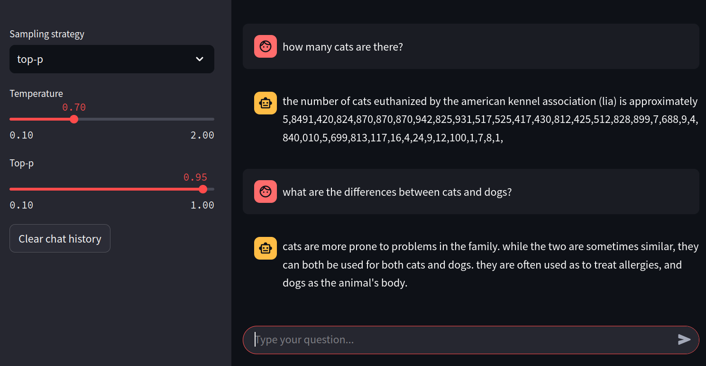

# My Little Language Model (aka the cursed chatbot)



This is a from-scratch implementation of a decoder-only transformer model for generating answers to short questions. 

- **Decoder-only** transformer model for **causal language modeling** 
- **Masked self-attention** layer for causal attention
- Only **36M parameters**
- BPE Tokenizer trained from scratch with a **vocabulary size of 20k**
- Trained on a subset of the GooAQ dataset with ~**850k question-answer pairs** (no pre-training)
- Supports **greedy** and **top-p** (nucleus) sampling at inference time
- Super basic **chatbot interface** for interacting with the model based on streamlit

## Quickstart

1. Use the notebook `gpu_training_colab_notebook.ipynb` that can be used to train the model on Google Colab. 
2. Download the model checkpoint and tokenizer JSON file and put them in the `temp` directory.
3. Run `streamlit run chatbot.py` to start the chatbot interface.
4. Get your questions answered by the wackiest chatbot you've ever seen!

## Data Format

The sequence format is as follows:

```
q1 q2 ... qN [SEP] a1 a2 ... aM [END] [PAD] ... [PAD]
```

with special tokens `[SEP]` for separating questions and answers, `[END]` for marking the end of the answer, and `[PAD]` for padding. The token `[UNK]` is used for out-of-vocabulary words.

The dataset is a subset of the [GooAQ dataset](https://github.com/allenai/gooaq). 

**Example questions and answers:**
```
Q: is it possible to get a false negative flu test?
A: This variation in ability to detect viruses can result in some people who are infected with the flu having a negative rapid test result. (This situation is called a false negative test result.)
```

```
Q: are you not supposed to rinse after brushing teeth?
A: Don't rinse with water straight after toothbrushing Don't rinse your mouth immediately after brushing, as it'll wash away the concentrated fluoride in the remaining toothpaste. This dilutes it and reduces its preventative effects.
```

## Learn More

### Going Further

Here are some ideas for extending the project:

- **Pre-training**: Pre-train the model on a large corpus of text data to improve performance.
- **Fine-tuning**: Fine-tune the model on the question-answering task prioritizing answer-generation.
- **Hyperparameter tuning**: Experiment with different hyperparameters to improve performance.
- **Scaling up**: Train a larger model with more parameters and a larger dataset.

### Learning Resources

Some websites and videos that are helpful for understanding transformers and self-attention:

- [Decoder-Only Transformers: The Workhorse of Generative LLMs (Blog post)](https://cameronrwolfe.substack.com/p/decoder-only-transformers-the-workhorse)
- [How Attention Mechanism Works in Transformer Architecture (YouTube)](https://www.youtube.com/watch?v=KMHkbXzHn7s) (Especially the parts on causal self-attention and GPT-2)
- [How does the (decoder-only) transformer architecture work? (AI StackExchange)](https://ai.stackexchange.com/a/40180)
- [Attention in transformers, step-by-step (YouTube)](https://www.youtube.com/watch?v=eMlx5fFNoYc)
- [Attention is all you need (The original transformers paper)](https://arxiv.org/pdf/1706.03762)
- [Stack Overflow answer explaining the role of masking in attention layers](https://stackoverflow.com/a/59713254)

---

I made this project for the course "Deep Learning (INF265)" at the University of Bergen (UiB) in the spring of 2025.

